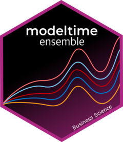

<!-- README.md is generated from README.Rmd. Please edit that file -->

```{r, include = FALSE}
knitr::opts_chunk$set(
  collapse = TRUE,
  comment = "#>",
  message = F,
  warning = F,
  paged.print = FALSE,
  fig.path = "man/figures/README-",
  # out.width = "100%"
  fig.align = 'center'
)
```

# modeltime.ensemble 

<!-- badges: start -->
[](https://travis-ci.com/business-science/modeltime.ensemble)
[](https://codecov.io/gh/business-science/modeltime.ensemble)
[](https://cran.r-project.org/package=modeltime.ensemble)


<!-- badges: end -->


> Unlocks Time Series Ensemble Forecasting with Tidymodels

A `modeltime` extension that implements ___ensemble forecasting methods___ including model averaging, weighted averaging via penalized regression, and stacking.


## Installation

``` r
devtools::install_github("business-science/modeltime.ensemble")
```

## Getting Started

1. [Getting Started with Modeltime](https://business-science.github.io/modeltime/articles/getting-started-with-modeltime.html): Learn the basics of forecasting with Modeltime. 
2. [Getting Started with Modeltime Ensemble](https://business-science.github.io/modeltime.ensemble/articles/getting-started-with-modeltime-ensemble.html): Learn the basics of forecasting with Modeltime ensemble models. 


## Make Your First Ensemble in Minutes

Load the following libraries.

```{r}
library(tidymodels)
library(modeltime)
library(modeltime.ensemble)
library(tidyverse)
library(timetk)
```

#### Step 1 - Create a Modeltime Table

Create a _Modeltime Table_ using the `modeltime` package. 

```{r}
m750_models
```

#### Step 2 - Make a Modeltime Ensemble

Then turn that Modeltime Table into a ___Modeltime Ensemble.___

```{r}
ensemble_fit <- m750_models %>%
    ensemble_average(type = "mean")

ensemble_fit
```

#### Step 3 - Forecast!

To forecast, just follow the [Modeltime Workflow](https://business-science.github.io/modeltime/articles/getting-started-with-modeltime.html). 

```{r}
# Calibration
calibration_tbl <- modeltime_table(
    ensemble_fit
) %>%
    modeltime_calibrate(testing(m750_splits), quiet = FALSE)

# Forecast vs Test Set
calibration_tbl %>%
    modeltime_forecast(
        new_data    = testing(m750_splits),
        actual_data = m750
    ) %>%
    plot_modeltime_forecast(.interactive = FALSE)
```


## Learning More

<a href="https://www.youtube.com/embed/elQb4VzRINg" target="_blank"></a>

[_My Talk on High-Performance Time Series Forecasting_](https://youtu.be/elQb4VzRINg)

Time series is changing. __Businesses now need 10,000+ time series forecasts every day.__ This is what I call a _High-Performance Time Series Forecasting System (HPTSF)_ - Accurate, Robust, and Scalable Forecasting. 

 __High-Performance Forecasting Systems will save companies MILLIONS of dollars.__ Imagine what will happen to your career if you can provide your organization a "High-Performance Time Series Forecasting System" (HPTSF System).

I teach how to build a HPTFS System in my __High-Performance Time Series Forecasting Course__. If interested in learning Scalable High-Performance Forecasting Strategies then [take my course](https://university.business-science.io/p/ds4b-203-r-high-performance-time-series-forecasting). You will learn:

- Time Series Machine Learning (cutting-edge) with `Modeltime` - 30+ Models (Prophet, ARIMA, XGBoost, Random Forest, & many more)
- NEW - Deep Learning with `GluonTS` (Competition Winners)
- Time Series Preprocessing, Noise Reduction, & Anomaly Detection
- Feature engineering using lagged variables & external regressors
- Hyperparameter Tuning
- Time series cross-validation
- Ensembling Multiple Machine Learning & Univariate Modeling Techniques (Competition Winner)
- Scalable Forecasting - Forecast 1000+ time series in parallel
- and more.

<p class="text-center" style="font-size:30px;">
<a href="https://university.business-science.io/p/ds4b-203-r-high-performance-time-series-forecasting">Unlock the High-Performance Time Series Forecasting Course</a>
</p>

