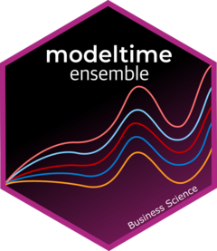
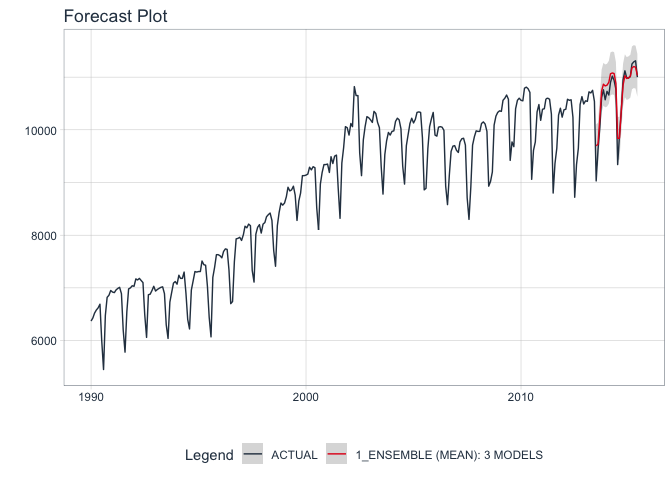

<!-- README.md is generated from README.Rmd. Please edit that file -->

# modeltime.ensemble 

<!-- badges: start -->

[](https://travis-ci.com/business-science/modeltime.ensemble)
[](https://codecov.io/gh/business-science/modeltime.ensemble?branch=master)
[](https://cran.r-project.org/package=modeltime.ensemble)


<!-- badges: end -->

> Ensemble Algorithms for Time Series Forecasting with Modeltime

A `modeltime` extension that implements ***ensemble forecasting
methods*** including model averaging, weighted averaging, and stacking.


## Installation

``` r
devtools::install_github("business-science/modeltime.ensemble")
```

## Getting Started

1.  [Getting Started with
    Modeltime](https://business-science.github.io/modeltime/articles/getting-started-with-modeltime.html):
    Learn the basics of forecasting with Modeltime.
2.  [Getting Started with Modeltime
    Ensemble](https://business-science.github.io/modeltime.ensemble/articles/getting-started-with-modeltime-ensemble.html):
    Learn the basics of forecasting with Modeltime ensemble models.

## Make Your First Ensemble in Minutes

Load the following libraries.

``` r
library(tidymodels)
library(modeltime)
library(modeltime.ensemble)
library(tidyverse)
library(timetk)
```

#### Step 1 - Create a Modeltime Table

Create a *Modeltime Table* using the `modeltime` package.

``` r
m750_models
#> # Modeltime Table
#> # A tibble: 3 x 3
#>   .model_id .model     .model_desc            
#>       <int> <list>     <chr>                  
#> 1         1 <workflow> ARIMA(0,1,1)(0,1,1)[12]
#> 2         2 <workflow> PROPHET                
#> 3         3 <workflow> GLMNET
```

#### Step 2 - Make a Modeltime Ensemble

Then turn that Modeltime Table into a ***Modeltime Ensemble.***

``` r
ensemble_fit <- m750_models %>%
    ensemble_average(type = "mean")

ensemble_fit
#> -- Modeltime Ensemble -------------------------------------------
#> Ensemble of 3 Models (MEAN)
#> 
#> # Modeltime Table
#> # A tibble: 3 x 3
#>   .model_id .model     .model_desc            
#>       <int> <list>     <chr>                  
#> 1         1 <workflow> ARIMA(0,1,1)(0,1,1)[12]
#> 2         2 <workflow> PROPHET                
#> 3         3 <workflow> GLMNET
```

#### Step 3 - Forecast\!

To forecast, just follow the [Modeltime
Workflow](https://business-science.github.io/modeltime/articles/getting-started-with-modeltime.html).

``` r
# Calibration
calibration_tbl <- modeltime_table(
    ensemble_fit
) %>%
    modeltime_calibrate(testing(m750_splits), quiet = FALSE)

# Forecast vs Test Set
calibration_tbl %>%
    modeltime_forecast(
        new_data    = testing(m750_splits),
        actual_data = m750
    ) %>%
    plot_modeltime_forecast(.interactive = FALSE)
```



## Learning More

<a href="https://www.youtube.com/embed/elQb4VzRINg" target="_blank"></a>

[*My Talk on High-Performance Time Series
Forecasting*](https://youtu.be/elQb4VzRINg)

Time series is changing. **Businesses now need 10,000+ time series
forecasts every day.** This is what I call a *High-Performance Time
Series Forecasting System (HPTSF)* - Accurate, Robust, and Scalable
Forecasting.

**High-Performance Forecasting Systems will save companies MILLIONS of
dollars.** Imagine what will happen to your career if you can provide
your organization a “High-Performance Time Series Forecasting System”
(HPTSF System).

I teach how to build a HPTFS System in my **High-Performance Time Series
Forecasting Course**. If interested in learning Scalable
High-Performance Forecasting Strategies then [take my
course](https://university.business-science.io/p/ds4b-203-r-high-performance-time-series-forecasting).
You will learn:

  - Time Series Machine Learning (cutting-edge) with `Modeltime` - 30+
    Models (Prophet, ARIMA, XGBoost, Random Forest, & many more)
  - NEW - Deep Learning with `GluonTS` (Competition Winners)
  - Time Series Preprocessing, Noise Reduction, & Anomaly Detection
  - Feature engineering using lagged variables & external regressors
  - Hyperparameter Tuning
  - Time series cross-validation
  - Ensembling Multiple Machine Learning & Univariate Modeling
    Techniques (Competition Winner)
  - Scalable Forecasting - Forecast 1000+ time series in parallel
  - and more.

<p class="text-center" style="font-size:30px;">

<a href="https://university.business-science.io/p/ds4b-203-r-high-performance-time-series-forecasting">Unlock
the High-Performance Time Series Forecasting Course</a>

</p>
