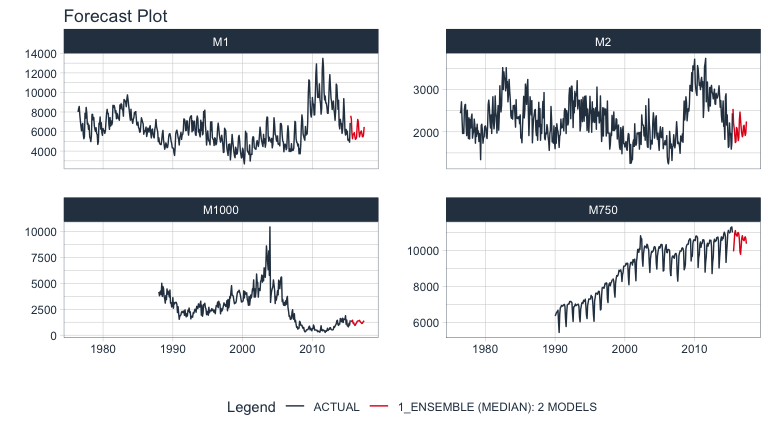

```{r, include = FALSE}
knitr::opts_chunk$set(
    # collapse = TRUE,
    message = FALSE, 
    warning = FALSE,
    paged.print = FALSE,
    comment = "#>",
    fig.width = 8, 
    fig.height = 4.5,
    fig.align = 'center',
    out.width='95%'
)
```

# What is a Recursive Model?

A *recursive model* uses predictions to generate new values for independent features. These features are typically lags used in autoregressive models.

# Why is Recursive needed for Autoregressive Models?

It's important to understand that a recursive model is only needed when using lagged features with a **Lag Size \< Forecast Horizon.** When the lag length is less than the forecast horizon, a problem exists were missing values (`NA`) are generated in the future data.

A solution that `recursive()` implements is to iteratively fill these missing values in with values generated from predictions. This technique can be used for:

1.  **Single ensemble recursive predictions** - Effectively turning any `ensemble` model into an Autoregressive (AR) model

2.  **Panel ensembles recursive predictions** - In many situations we need to forecast **more than one time series**. We can batch-process these with 1 model by processing time series groups as panels. This technique can be extended to recursive forecasting for scalable models (1 model that predicts many time series).

Here's an example of a panel forecast that uses a recursive ensemble with a Linear Regression and MARS model.

```{r, echo=F}

```

# Single Ensemble Recursive Example

> Use single ensembles to forecast a single time series

First, we need to load the necessary libraries:

```{r}
library(modeltime.ensemble)
library(modeltime)
library(tidymodels)
library(earth)
library(tidyverse)
library(lubridate)
library(timetk)
```

Next, we select a forecast horizon of 24 days and extend the data frame with the function `future_frame()`. We do this to create a future dataset, which we can distinguish because its values will be NA.

```{r}
FORECAST_HORIZON <- 24

m750_extended <- m750 %>%
    group_by(id) %>%
    future_frame(
        .length_out = FORECAST_HORIZON,
        .bind_data  = TRUE
    ) %>%
    ungroup()
```

The next step is to create a recipe where we specify the formula we are going to use and create the lagged variables that our model will use. Notice that we create lags up to our forecast horizon.

```{r}
recipe_lag <- recipe(value ~ date, m750_extended) %>%
    step_lag(value, lag = 1:FORECAST_HORIZON)

# Data Preparation
m750_lagged <- recipe_lag %>% prep() %>% juice()
m750_lagged
```

We divide the data set into training dataset and future dataset:

```{r}
train_data <- m750_lagged %>%
    filter(!is.na(value)) %>%
    drop_na()

future_data <- m750_lagged %>%
    filter(is.na(value))
```

Next, we are going to create two models that we will then join into an ensemble. The first model is a linear model while the second model is a MARS model. In a real scenario, we would typically do a pre-selection work where we would analyze more models and keep those with better performance to make the ensemble.

```{r}
model_fit_lm <- linear_reg() %>%
    set_engine("lm") %>%
    fit(value ~ ., data = train_data)

model_fit_mars <- mars("regression") %>%
    set_engine("earth", endspan = 24) %>%
    fit(value ~ ., data = train_data)
```

The next step is to create an ensemble of type mean (in which the predictions of the two models will be averaged) and right after that we use the `recursive()` function to create the recursive model. You can consult all the information of the function by typing in the console `?modeltime::recursive`.

```{r}
recursive_ensemble <- modeltime_table(
    model_fit_lm,
    model_fit_mars
) %>%
    ensemble_average(type = "mean") %>%
    recursive(
        transform  = recipe_lag,
        train_tail = tail(train_data, FORECAST_HORIZON)
    )

recursive_ensemble
```

Finally, we predict over our dataset and visualize the predictions:

```{r}
fcast <- modeltime_table(
    recursive_ensemble
) %>%
    modeltime_forecast(
        new_data = future_data,
        actual_data = m750
    )

fcast %>%
    plot_modeltime_forecast(
        .interactive = FALSE,
        .conf_interval_show = FALSE,
    )
```

# Panel Ensemble Recursive Example

> Use panel ensembles to batch forecast multimple time series

First, we select a forecast horizon of 24 days and extend the data frame with the function `future_frame()`. We do this to create a future dataset, which we can distinguish because its values will be NA.

```{r}
FORECAST_HORIZON <- 24

m4_extended <- m4_monthly %>%
    group_by(id) %>%
    future_frame(
        .length_out = FORECAST_HORIZON,
        .bind_data  = TRUE
    ) %>%
    ungroup()
```

Then we create a transformer function that will be in charge of generating the lags for each time series up to each forecasting horizon:

```{r}
lag_transformer_grouped <- function(data){
    data %>%
        group_by(id) %>%
        tk_augment_lags(value, .lags = 1:FORECAST_HORIZON) %>%
        ungroup()
}
```

Then, we apply the function and divide the data into training and future set:

```{r}
m4_lags <- m4_extended %>%
    lag_transformer_grouped()

m4_lags
```

```{r}
train_data <- m4_lags %>%
    drop_na()

future_data <- m4_lags %>%
    filter(is.na(value))
```

Next, we are going to create two models that we will then join into an ensemble. The first model is a linear model while the second model is a MARS model.

```{r}
model_fit_lm <- linear_reg() %>%
    set_engine("lm") %>%
    fit(value ~ ., data = train_data)

model_fit_mars <- mars("regression") %>%
    set_engine("earth") %>%
    fit(value ~ ., data = train_data)
```

The next step is to create an ensemble of type mean (in which the predictions of the two models will be averaged) and right after that we use the `recursive()` function to create the recursive model. Note that unlike the previous example, in this case we have to pass to the recursive function the argument `id` and we have to use the `panel_tail()` function to create the train_tail.

```{r}
recursive_ensemble_p <- modeltime_table(
    model_fit_mars,
    model_fit_lm
) %>%
    ensemble_average(type = "median") %>%
    recursive(
        transform  = lag_transformer_grouped,
        train_tail = panel_tail(train_data, id, FORECAST_HORIZON),
        id = "id"
    )

recursive_ensemble_p
```

Finally, we predict over our dataset and visualize the predictions:

```{r}
fcast <- modeltime_table(
    recursive_ensemble_p
) %>%
    modeltime_forecast(
        new_data = future_data,
        actual_data = m4_lags,
        keep_data = TRUE
    )

fcast %>%
    group_by(id) %>%
    plot_modeltime_forecast(
        .interactive = FALSE,
        .conf_interval_show = FALSE,
        .facet_ncol = 2
    )
```

# Summary

Recursive modeling can be applied to ensembles. But, this is just a small portion of everything that can be done.... If you want to get all the details, read on!

## Take the High-Performance Forecasting Course

> Become the forecasting expert for your organization

<a href="https://university.business-science.io/p/ds4b-203-r-high-performance-time-series-forecasting/" target="_blank"></a>

[*High-Performance Time Series Course*](https://university.business-science.io/p/ds4b-203-r-high-performance-time-series-forecasting/)

### Time Series is Changing

Time series is changing. **Businesses now need 10,000+ time series forecasts every day.** This is what I call a *High-Performance Time Series Forecasting System (HPTSF)* - Accurate, Robust, and Scalable Forecasting.

**High-Performance Forecasting Systems will save companies by improving accuracy and scalability.** Imagine what will happen to your career if you can provide your organization a "High-Performance Time Series Forecasting System" (HPTSF System).

### How to Learn High-Performance Time Series Forecasting

I teach how to build a HPTFS System in my [**High-Performance Time Series Forecasting Course**](https://university.business-science.io/p/ds4b-203-r-high-performance-time-series-forecasting). You will learn:

-   **Time Series Machine Learning** (cutting-edge) with `Modeltime` - 30+ Models (Prophet, ARIMA, XGBoost, Random Forest, & many more)
-   **Deep Learning** with `GluonTS` (Competition Winners)
-   **Time Series Preprocessing**, Noise Reduction, & Anomaly Detection
-   **Feature engineering** using lagged variables & external regressors
-   **Hyperparameter Tuning**
-   **Time series cross-validation**
-   **Ensembling** Multiple Machine Learning & Univariate Modeling Techniques (Competition Winner)
-   **Scalable Forecasting** - Forecast 1000+ time series in parallel
-   and more.

<p class="text-center" style="font-size:24px;">

Become the Time Series Expert for your organization.

</p>

<br>

<p class="text-center" style="font-size:30px;">

<a href="https://university.business-science.io/p/ds4b-203-r-high-performance-time-series-forecasting">Take the High-Performance Time Series Forecasting Course</a>

</p>
